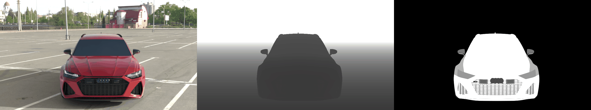

<div align="center">
	<p>
		<a href="https://www.segulatechnologies.com/en/">
			
		</a>
		<a href="https://laboratoirehubertcurien.univ-st-etienne.fr/en/index.html">
			
		</a>
	</p>
	<p>
		<em>Developed thanks to Segula Technologie and Hubert-Curien laboratory</em>
	</p>
</div>

# BlendGen

A Blender add-on that enables photorealistic RGB-D database generation via a simple and powerful GUI. BlendGen enables parameters control such as image resolution, background environment set-up using 360° images, camera positioning, depth acquisition resolution, objects positioning and labeling. 
We hope BlendGen will help the community by making image database generation more intuitive and overall easier. 

<div align="center">
	
</div>

## Prerequisites
BlendGen has been tested with [Blender](https://www.blender.org/) <em>3.1</em> and <em>3.2.1</em>. However, it might still work for newer version.

## Installation
To use BlendGen it is necessary to open Blender and then:

1. Click on ***Edit***  tab -> ***Preference***
2. Click on ***Install***
3. Search for BlendGen path
4. Click on ***Install Add-on***</em>
5. Enable BlendGen add-on by ***ticking the box***
6. Open the Blender ***Object Properties*** tab
7. Enjoy BlendGen !

<div align="center">
	
</div>

## GUI architecture

The global user interface architecture is composed of ***4 blocks***.

* The ***General Parameters*** block contains the high-level database parameters such as the image resolution, the images number to generate and the image types to generate (RGB, depth, label). 
* The ***Background Properties*** block makes possible to add a 360° background image that will be used to create a photorealistic background environment. 
* The ***Camera Properties*** block enables to select different depth acquisition methods and defining a depth acquisition range. The camera positioning can be controlled in this block by either positioning it in random ranges or making it follow complexes trajectories and track objects. 
* The ***Objects Properties*** block configures all the object parameters such as their position, their rotation, their label as well as their visibility during the different rendering stages (RGB, depth, label).

<div align="center">
	
</div>

<em>More detailed explainations can be found in our paper.</em>

## Workflow

The regular workflow using BlendGen is the following.

1. Gathering assets (3D models, HDRI image...)
2. Set up general dataset parameters (image resolution, number of image, type of image)
3. Create background environment using either 360° images or 3D models
4. Position the main assets and set-up their label values
5. Position the camera
6. Adjust lighting
7. Generate the database

<div align="center">
	
</div>

## Cite
Paper accepted at International Journal of Computer Information Systems and Industrial Management Applications
```
@article{maron:hal-04205883,
  title = {{BlendGen: A Blender Add-on for General RGB-D Databases Generation}},
  author = {Maron, Cedric and Fresse, Virginie and Morand, Karynn and Konik, Hubert},
  url = {https://hal.science/hal-04205883},
  journal = {{International Journal of Computer Information Systems and Industrial Management Applications}},
  publisher = {{Machine Intelligence Research Labs (MIR Labs)}},
  volume = {15},
  pages = {332--341},
  year = {2023},
  month = Jun,
  keywords = {Blender ; Image Database Generation ; RGB-D images database ; CGI},
  pdf = {https://hal.science/hal-04205883/file/Paper29.pdf},
  hal_id = {hal-04205883},
  hal_version = {v1}, 
}
```

## License
The source code for the site is licensed under the MIT license, which you can find in the LICENSE file.